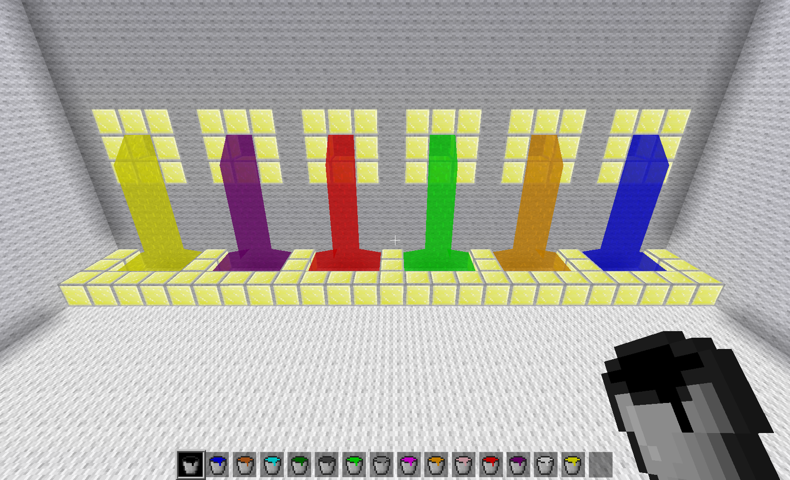

# Dyed Water Mod

Colourful water for Minetest game.

Adds the liquids and buckets for them. To craft, combine a bucket of water or river water with the dye to make a bucket of dyed water with the colour of dye you used.

## Credit

### MTG default textures modified by me and available under the following license.

Licenses of media (textures, models and sounds)
-----------------------------------------------

Attribution-ShareAlike 3.0 Unported (CC BY-SA 3.0)
Copyright (C) 2010-2023:

  celeron55, Perttu Ahola <celeron55@gmail.com>
  Cisoun
  G4JC
  VanessaE
  RealBadAngel
  Calinou
  MirceaKitsune
  Jordach
  PilzAdam
  jojoa1997
  InfinityProject
  Splizard
  Zeg9
  paramat
  BlockMen
  sofar
  Neuromancer
  Gambit
  asl97
  KevDoy
  Mito551
  GreenXenith
  kaeza
  kilbith
  tobyplowy
  CloudyProton
  TumeniNodes
  Mossmanikin
  random-geek
  Extex101
  An0n3m0us
  Lopano

You are free to:
Share — copy and redistribute the material in any medium or format.
Adapt — remix, transform, and build upon the material for any purpose, even commercially.
The licensor cannot revoke these freedoms as long as you follow the license terms.

Under the following terms:

Attribution — You must give appropriate credit, provide a link to the license, and
indicate if changes were made. You may do so in any reasonable manner, but not in any way
that suggests the licensor endorses you or your use.

ShareAlike — If you remix, transform, or build upon the material, you must distribute
your contributions under the same license as the original.

No additional restrictions — You may not apply legal terms or technological measures that
legally restrict others from doing anything the license permits.

Notices:

You do not have to comply with the license for elements of the material in the public
domain or where your use is permitted by an applicable exception or limitation.
No warranties are given. The license may not give you all of the permissions necessary
for your intended use. For example, other rights such as publicity, privacy, or moral
rights may limit how you use the material.

For more details:
http://creativecommons.org/licenses/by-sa/3.0/

### MTG bucket textures modified by me and available under the following license.

Licenses of media (textures)
----------------------------

Attribution-ShareAlike 3.0 Unported (CC BY-SA 3.0)
Copyright (C) 2015-2016 ElementW

You are free to:
Share — copy and redistribute the material in any medium or format.
Adapt — remix, transform, and build upon the material for any purpose, even commercially.
The licensor cannot revoke these freedoms as long as you follow the license terms.

Under the following terms:

Attribution — You must give appropriate credit, provide a link to the license, and
indicate if changes were made. You may do so in any reasonable manner, but not in any way
that suggests the licensor endorses you or your use.

ShareAlike — If you remix, transform, or build upon the material, you must distribute
your contributions under the same license as the original.

No additional restrictions — You may not apply legal terms or technological measures that
legally restrict others from doing anything the license permits.

Notices:

You do not have to comply with the license for elements of the material in the public
domain or where your use is permitted by an applicable exception or limitation.
No warranties are given. The license may not give you all of the permissions necessary
for your intended use. For example, other rights such as publicity, privacy, or moral
rights may limit how you use the material.

For more details:
http://creativecommons.org/licenses/by-sa/3.0/
